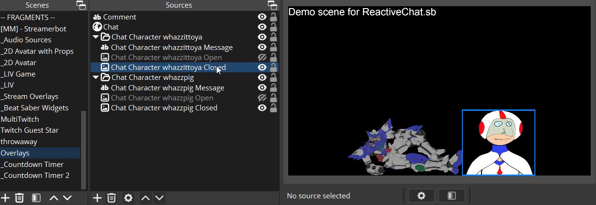
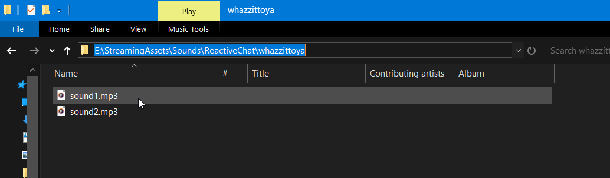
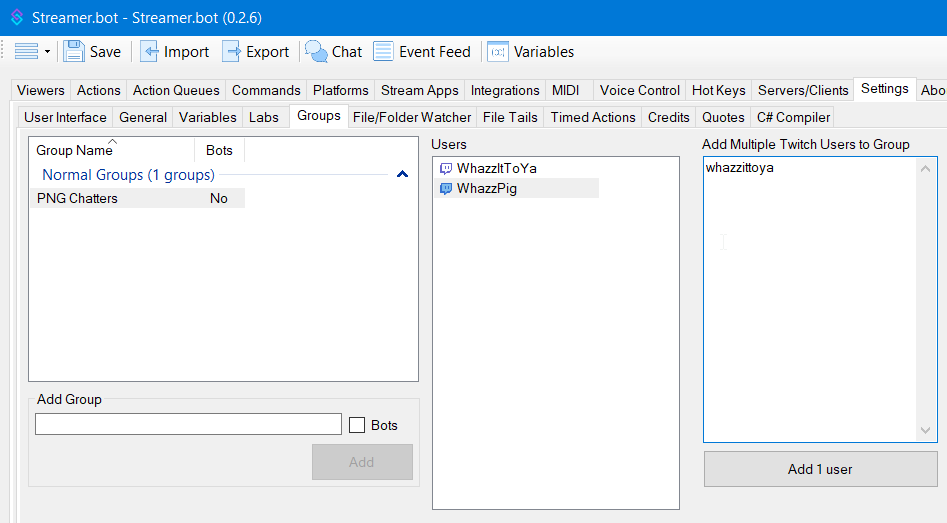

# Reactive Chat for OBS & Streamer.bot

Puts PNGTuber-like avatars into your stream which react when selected users chat.  Unrelated to TTS.  Can optionally display the messages, or play random sounds.

  <video src="ReactiveChat.mp4" width="50%"></video>

## Prerequisites
* OBS (developed & tested on version 30)
* Streamer.bot 0.2.4 or newer
* Idle & speaking images for each friend whose chat messages you want a reactive avatar for
* A friend

## Installation & Setup

### Avatar images in OBS

1. In the OBS scene you want your reactive PNGs, create a Source Group called "Chat Character *twitch-login*", where *twitch-login* is the twitch user login (the lowercase, no-spaces name) of a user you want the avatar for.
2. Inside the group, create two Image Sources titled "Chat Character *twitch-login* Open" and "Chat Character *twitch-login* Closed", representing the "mouth open" and "mouth closed" images of the avatar.
  * Feel free to add fade hide & show transitions or other effects on being made visible/hidden.
3. (optional) Inside the group, create a GDI Text source titled "Chat Character *twitch-login* Message".  This will display the chat messages sent by the user.  Set whatever properties (color, font, alignment) that you'd like.
4. Repeat for each user you want an avatar for.

  

### Avatar sounds

If you don't want sounds to play when a user chats, then skip this section.

* Create a folder on your PC somewhere for the audio files.
* If you want each user to have their own sounds:
  * Create subfolders, one for each user, named "*twitch-login*" (the same convention as above)
* Place all the sound files you want to have play randomly, into the folder(s).

  

### Streamer.bot

**Import Code** (2025/01/07)
```
U0JBRR+LCAAAAAAABADtXNluG0cWfQ+QfyAE+C1l1L7kzePEjoGJHViBB4NxHm5tUiNkk8NFsWP433OrKUokm5TJFiVKhvVguFnF7uK5yzn3VpGfvv+u1zsZpCmc/Nj7VC7wsoZBwsuT316/7L1NEKbVReo9P4fpyQ+XM2A2PR+Oy5z/nMPff7+a/j78L1yNXqTxpBrWZZg9pU/p1UBMkzCuRtPLweXbDd/O6mfhcqSe9fuLsUFVV4PZ4N3VPctgGfvczDiJsLJ2aO4xwVf+N3+ltxhqhqtYHmy9DVSDIyyJQGRmnlgGiUSjsmUyOG3zYnHN2/4/S7MGkpyo1dEYnK8ZkTFH4oADCcxaB165zNTKO1MNvp/KU6fjWVoZ+RD6s5hejIeDX6rJdDj+ePOk31Idq/oMJ2XoT1ZmLRus2Kn3cjjt/ZomEzhLK6s5Gw9no+WZK6PQ/ws+TtAQGxYyhjoOB1cWai0hDOswG49TPd00Oh1XZ2dowWWzrJlmyTwhMsUFtQSUtURSrom32hFusmNBUK01W174/BEfRwUDJsT6yFYTXCM8WfjMH8ujn68v/ljBqe1jmz7MbJLG/x6eVY2vPylXr9FOT1orb4zyes2E04LW+sw5PMozQZVAPESBx3JJfNDoiJ4B9+AZFbr11r9SdXZebIPxuAU6pezGpa0G5I6wVnVMH8rjVgD94Sa8LmBclVsuoKjql83j1289HKUxXPph67NcQH8eqS+KD7beOzfdqwZHevlHNvyz+GvdYDyrXw0GKVYwTf0NETt/SkbzXcUKayGHK3t224WUm7zdZTHN01YW1AKt5N/f506w0ZbNKh0oQ60TxAB6nPTAiI05EKCJl8SnEvAubsd4a+T2bsd2d7sVlxCeC8cy4VYqzDw6E++DIMzFYIUNluq2Ty1cYmGE9ey3hCHVktoUDKGKGyKlEARACkIZVSpKZU3OXTCUh0eQ754JmzCdp89VSuj3YTRJcWl8MXxtkjY772uER8fOp6MEf/be1F25ufWE+yHnRX4uEz993uzgAphT3CH4PHkig0FuUjEQriSz3juRQW2jbkP5Q6HuKxZ5gupzWkH/p9SHj23qHsCHd4upG7iiMcvNGcFF7r1VnmQwCFh0mYBRmBYYDcJGpgOYTlmVttG88rA2mXRICV/g8gWAgyHWCm9Gqf5pNmftu0DR8sA0pUhGXKDvJYTSU0UJWOqcUjok+2BQlN2oCR3BUeMNCYJTIhkTxFkeidUm8aAsSOu/SE3b2d2zaEJGUmJOoqiMGLguoPBmFriizNvk40GZqSt8ewjKFWZn4LOREeWKjUgqKhPLFcOagqnIEzgE9DbMLrPyxmVHTBSojpgrJGQEsdRIEXUGDQ8Dv67KCLQQhnMihUyFWjHWHKB/GAhCcxQupl107IGfjjkVAAm6cmGPjKQfmSUWKdtwUEjt7dRwDPxEN/x8djZaE4jSKJylcRzjKxWNo5NXIohE2zXtHvgpblXiWDMHJzA9WIbxq30iLloOhqPVXKcMeHD81NF05b4Z9EpXronoI6nG529ev3j18uFJxm76arXUH/rJaUh1u7a60hFvLtIYJVi7J7JT7coE9ZFDIBZQW0mPxAZOS8zOMSYw1kvWfvZOtWur23TUlknBcTgbhxuAnPvSOYzRVGncu6EvtROyQQesqgArWmmQV6VLxDuwRAjOUwm30C3v3Amye3Bfuxl1XQdsBVfRbq2VDJKBwJStE0dypUh+4GkmKkeLvMfsJm13OxDvgf7WIWxVAltxFLQrkMJZ77D2Z85hitceWTAZTYLhKVCE2WX7QIDcowxYB3IynNXxxbAf03h7nIcf37//+QMMRv30/v1iF6cE/2l59+T9+9tGPiItfPaYTmlCWWiExcoVHMq2kH2wjvHQSbHdAdZH7GXtWXYs9bJMzNYlINYzdGWK90ANCejPDG9DhVRuBd4jqZJ31aTCx34dsmRSNMgiyp4sREk7PiYNx65MbF7ZMHOK2v1kQ8sdP0idbrsHsAjEyJyngmABgKU7x/QHHAMxAbBAo1Ixhi6BKLb25Q9Tu99rHO5Zvj66OCy82vu1MOy3UGxCsfe8P0Q/2RqRrV25A0ZkBJWMS5IkBuhypSL3DJlS6EilD4rChmL/KBGpd1cht7dI8dGjZEgZcpC2bAlZpYhUVBMfsPJnDA1CvUiRdipSDm8P1dEeW8vj7dbYcD5k/tnSh2kzdzCfcIqhPBql2Lb0IS0kcg4QPQGVGzGJOilhqnXKR1SZJmnoxmHuiAXQHPtNuWZd0Y/qs5Kcf11USG07jsr5p8m0Wd7GNmBMk2lVN3XVu8u773bnmDLM+tPFDkwLybmBDLXZR+YJZcVA3ibiAmoOrmnQJgWhLHQxEOMtcO6xw70E2j2Z6conWvtKi8qttYrLLS6lGOWuFFkaa67SbbGZWpKN4pLT4Klsb2DsZIDj7hPui/Dy6R+1tfpt55lvJ382BfdOlb7iKZiyM21TxCIWAJ2wnK3gmBFk9Ap8cgc++XPPm6s0hkBTiESr5LA8iM2JQ0W8cErT6GOG7Q6xw+6MdZYZLi3RAgyWaEETJzIKQs94ZgogmYexu3XECm1PEzy+Uz+l79b7OWeUTF9HjRbTRRU2bJA1g3nenyxCcqlf2RaRuaqryfm/Uh6O0/NhjXQ824xoM/ti2J81uLJ2TIwTftZJdZFu4N46LpimtZDZJL2o5kz0bHI564ZOs/bKaFCECYlOp5UhXgmLxAxGMFuOQ7YPOu0Q0WZbRB9qP+k+Y3rfTe9H13Vpegzf2i57tF3ussynEqjJ1BBgAYgUwFEs5yJbUBsLFhKnnSTy4cv8fYrIu2273GUbTDueqEfJqFLEIM6hHEdhhqCKTAaYcdo9EHvsIRu7tF227rl/sQlzlz0XZ5j3AXOyUZiTpfQMK0oIBEPGMimDkqrToYjtPZfuHLZPX+xr6rrYiElNoZblRRSb4AheCZIZk4xyYbPs1Ei+g67LHqdWjth1aW0tf6Hr4i3zDpmEIP4SKQUVidNYmojEoSjAnKHjgYKDd11ucbjlUF2Xti9+67p07rpwx6NKyJlWseJ6DmPfWUqM8clzb5FPO7XE76DrcrzzFRJ0oAxJSwWhC4cJAhSRyh58Drl8o+px7+v+UsWv8XBFJ+F0FBGbwPiYTSI0QiSSRQxDHg0JXgvKNFb7otNX9h7d6Yr5fxbz54H0he/Z792Z8/1h+HPH0DjZJT/sHeVLK1iP4Hb1fw71WeqdNl64DacwHAww7lbARv/wE3xOmp6m8cVaTF0PPu9XGIurg9NqsJhfXrn8EYTrX1xg81jAdDMajlERlXzTRMBT/vQyE7Z/UqEZlcSnKeCk77/7/A/DAtuZF0IAAA==
```

1. Import the above into streamerbot.
2. Edit the action "PNG Chat CONFIG" with your desired configuration:
  * `obsScene` : should be the name of the OBS Scene containing the PNG avatars you set up in OBSscene
  * `obsSource` : should be left as-is, unless you used a name prefix other than "Chat Character *twitch-user*" for your sources
  * `initialDelay` : The number of milliseconds delay between receiving the chat message, and displaying the mouth-open image.
  * `mouthOpenDuration` : Milliseconds that the mouth should remain open (and the chat message displayed, if using that feature)
  * `soundFolder` : The path of the sound folder, e.g., `c:\StreamSounds\ReactiveChat`.  If you don't want sounds, leave as-is.
    * If you set up to have different sounds per user above, then add a `\%userName%` at the end.  E.g., `c:\StreamSounds\ReactiveChat\%userName%`.
    
   accounts to the group.  This will determine who will get an avatar.

  

